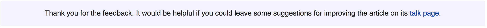

# wiki user feedback

It is a user feedback gadget for technical documentation currentkly deployed on MediaWiki.org & Wikitech (see here: https://www.mediawiki.org/wiki/MediaWiki:Gadget-userfeedback.js)

### Screenshots

Feedback form design:
<table><tr><td>

</td></tr></table>
Confirmation message for a thumbs-down vote:

Confirmation message for a thumbs-up vote:

Previous form design with "Yes" or "No" buttons generated via OOUI:

